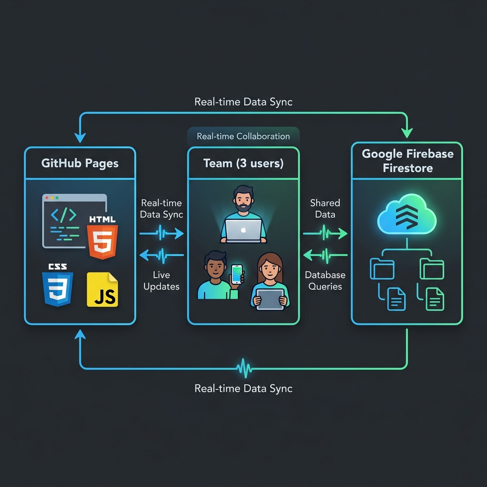
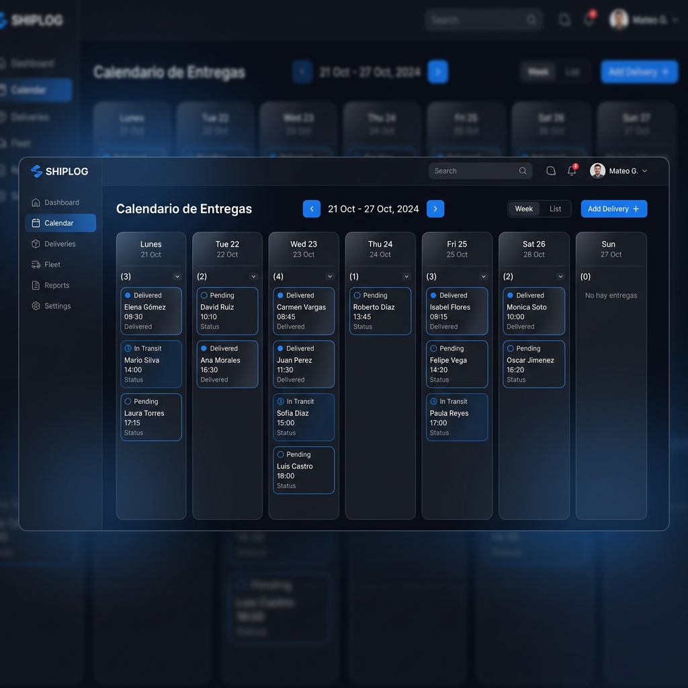
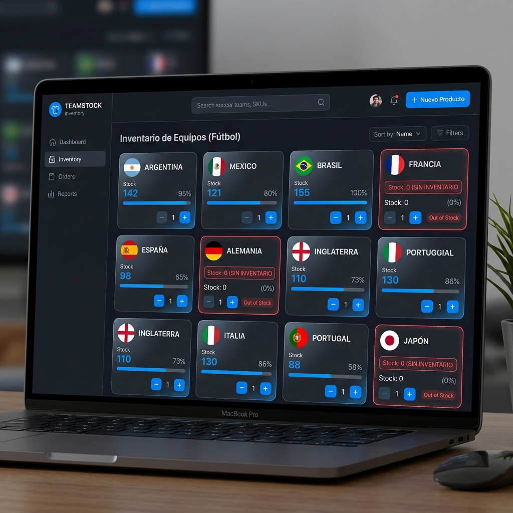
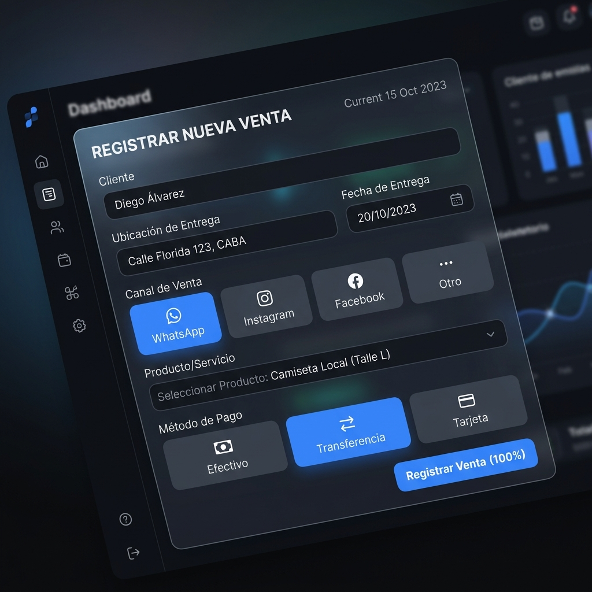
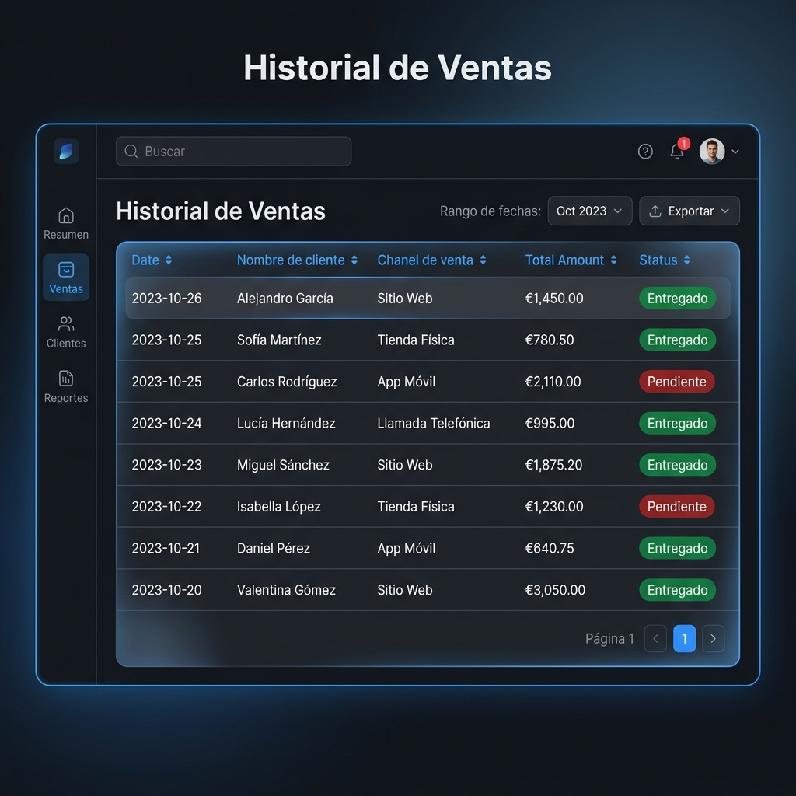

# 🏆 CRM de Jerseys - Mundial 2026

Este proyecto es un **CRM (Customer Relationship Management) e Inventario en tiempo real** diseñado a medida para un emprendimiento de venta de jerseys de selecciones del Mundial 2026. 

El sistema permite coordinar las operaciones de un equipo de 3 personas (el dueño del negocio, el vendedor y el repartidor) de forma 100% gratuita y sincronizada en la nube.

---

## 🛠️ Arquitectura y Tecnologías
La aplicación fue diseñada bajo una arquitectura ágil de **costo $0** y sin dependencias de servidores ni compiladores complejos:

*   **Frontend:** HTML5, CSS3 (con diseño oscuro moderno y variables dinámicas) y JavaScript puro (Vanilla JS).
*   **Base de Datos:** Google Firebase Firestore. Permite sincronización de datos en tiempo real entre múltiples dispositivos simultáneamente.
*   **Hosting:** GitHub Pages. Aloja la página web de manera pública y gratuita.

---

## 📋 Funciones Principales

### 1. 📅 Calendario Semanal de Entregas
Diseñado para la logística del repartidor. Muestra una agenda de Lunes a Domingo de la semana actual con controles para avanzar o retroceder semanas. 

*   **Detalles al Instante:** Al dar clic en cualquier entrega, se abre un modal con el nombre del cliente, ubicación de entrega, método de pago, monto a cobrar y el listado de jerseys vendidos con su personalización de talla, tipo y nombre.
*   **Entrega Rápida:** Cuenta con un botón para marcar la orden como "Entregado", actualizando su estado de inmediato en el historial.

---

### 2. 📋 Gestión de Pedidos (Compras y Stock)
Creado para separar el inventario físico disponible de las solicitudes de los clientes. Está dividido en dos columnas:
*   **Pendientes (Por conseguir):** Lista de jerseys que han sido vendidos pero aún no se tienen físicamente. 
    *   *Edición en caliente:* Permite escribir y actualizar el costo de compra de las camisetas directamente en la tarjeta, guardando el valor de forma automática en Firebase.
    *   *Checkbox verde:* Al presionar el checkbox, este se pinta de verde y transfiere el pedido a la columna de "Completados", **sumando de forma automática +1** (o la cantidad del pedido) al inventario general de ese país.
*   **Completados (En mano):** Listado de mercancía conseguida lista para empacar. Son interactivos y permiten abrir la edición si hubo algún error en el pedido.

---

### 3. 👕 Control de Inventario Inteligente
Una cuadrícula con las 48 selecciones del Mundial más Cabo Verde.

*   **Edición rápida:** Clic directo sobre el número de stock para escribir la cantidad exacta sin tener que presionar el botón `+` repetidamente.
*   **Añadir Producto:** Botón para agregar de forma manual cualquier producto que no estuviese en la lista inicial.
*   **Stock Negativo:** Si vendes un artículo con stock en `0`, el inventario baja automáticamente a `-1`, indicando claramente en color rojo cuántas piezas hacen falta conseguir para ese pedido.

---

### 4. 💰 Registro de Ventas Ágil
Formulario optimizado para pantallas móviles que permite registrar un pedido en menos de 10 segundos.

*   **Buscador predictivo (Autocomplete):** En lugar de desplegables eternos, un buscador de texto inteligente te muestra coincidencias de países con su stock en tiempo real a medida que escribes.
*   **Botones Cuadrados:** Selectores táctiles rápidos para el Canal de Venta (WhatsApp, Instagram, etc.) y Método de Pago.
*   **Personalización de Jersey:** Opciones para seleccionar Talla (S a XXL), Tipo (Local / Visitante) y una casilla de **Personalizar Nombre** (si se activa permite escribir número y nombre del jugador; si no se activa, por defecto registra `S/N`).

---

### 5. 📜 Historial Completo
Una tabla cronológica que lista todas las operaciones guardadas, montos cobrados y estados actuales (Pendiente / Entregado) para auditoría del administrador del negocio.

---

## 💻 Notas del Desarrollador (¿Cómo se construyó?)
El CRM se desarrolló mediante programación en pareja con **Antigravity** (la IA de Google DeepMind). 

*   **Enfoque de diseño:** Estilo *Glassmorphism* oscuro de nivel premium. En PC muestra una barra lateral de navegación cómoda, y en celulares se transforma en una barra de pestañas inferior optimizada para el pulgar.
*   **Sincronización:** Firebase Firestore maneja las actualizaciones en vivo. Cuando un vendedor registra una venta en la calle, el stock se actualiza en el inventario del dueño y la entrega aparece en el calendario del repartidor al instante.
