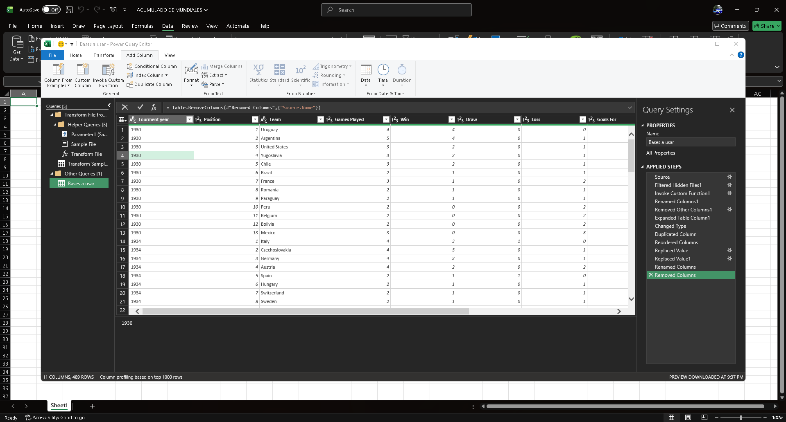
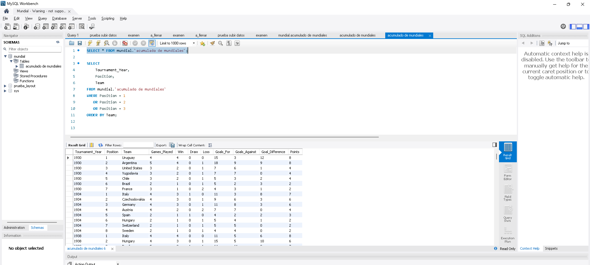

# Proyecto Mundial - Análisis de Datos ⚽

## Limpieza de Datos
Esta base de datos se compone de 23 conjuntos de datos (datasets).
- 22 datasets contienen información histórica detallada de los partidos y jugadores de cada copa mundial.
- 1 dataset contiene información generalizada sobre los torneos y sus ganadores.

### Acumulado de los 22 Datasets
Acumulamos los 22 datasets históricos, normalizamos la estructura y limpiamos la información para consolidar una única fuente de verdad.

### Proceso de Limpieza
Eliminamos registros duplicados, corregimos inconsistencias en nombres de países y estandarizamos formatos de fechas.

### Normalización de Datos
Removí columnas innecesarias y creé una nueva columna calculada para tener el año de referencia de cada mundial de forma homogénea.

### Análisis y Consultas en MySQL Workbench
Luego, cargué mis datos limpios en MySQL Workbench para transformarlos y realizar una sesión de lluvia de ideas (brainstorming) sobre las siguientes preguntas clave de negocio:

1. ¿Cuántos equipos jugaron en cada torneo?
2. ¿Qué equipos han jugado más veces en toda la historia del fútbol?
3. ¿Qué equipos quedaron en el Top 3 de cada torneo?
4. ¿Qué equipo en toda la historia de los mundiales ganó el campeonato con la menor cantidad de partidos perdidos?
5. ¿Cómo se distribuyen los mejores equipos (considerando solo el Top 5 por torneo) alrededor del mundo, agrupados por continentes, y cuántos torneos ha ganado cada continente?
6. ¿Cuáles son los peores equipos por año, considerando solo los últimos 2 equipos de cada torneo?
7. ¿Dónde están ubicados los equipos del mundial según su continente? ¿Están concentrados en alguna región específica?

### Resolviendo las preguntas con SQL
Comencé a responder estas preguntas ejecutando consultas analíticas avanzadas.
