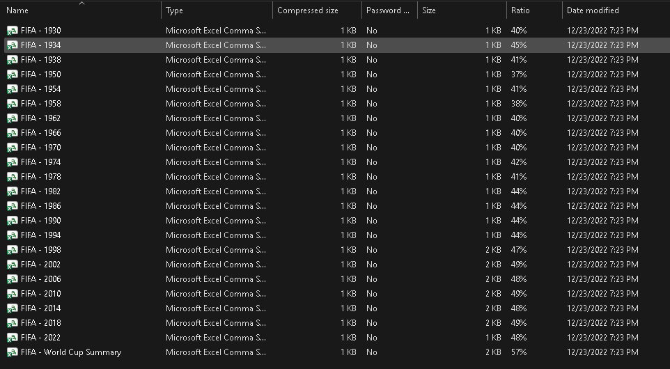
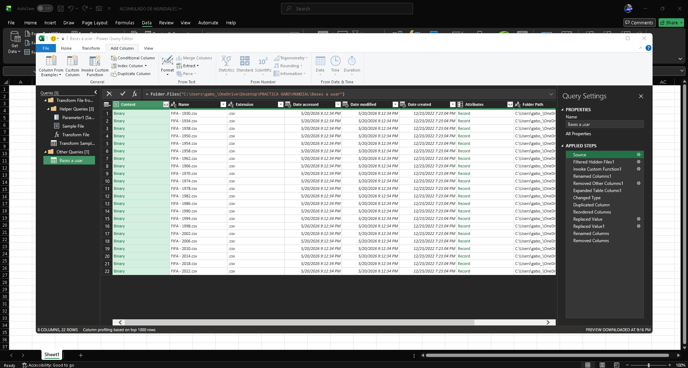

# Projeto Copa do Mundo - Análise de Dados ⚽

## Limpeza de Dados
Este banco de dados é composto por 23 conjuntos de dados (datasets).
- 22 datasets contêm informações históricas detalhadas das partidas e jogadores de cada Copa do Mundo.
- 1 dataset contém informações gerais sobre os torneios e seus vencedores.

### Acumulado dos 22 Datasets
Acumulamos os 22 datasets históricos, normalizamos a estrutura e limpamos as informações para consolidar uma única fonte de verdade.

### Processo de Limpeza
Removemos registros duplicados, corrigimos inconsistências nos nomes dos países e padronizamos formatos de datas.

### Normalização de Dados
Removi colunas desnecessárias e criei uma nova coluna calculada para ter o ano de referência de cada Copa do Mundo de forma homogênea.

### Análise e Consultas no MySQL Workbench
Depois, carreguei meus dados limpos no MySQL Workbench para transformá-los e realizar uma sessão de brainstorming sobre as seguintes perguntas-chave de negócios:

1. Quantas seleções jogaram em cada torneio?
2. Quais seleções jogaram mais vezes em toda a história do futebol?
3. Quais seleções ficaram no Top 3 de cada torneio?
4. Qual seleção em toda a história das Copas do Mundo venceu o campeonato com o menor número de derrotas?
5. Como estão distribuídas as melhores seleções (considerando apenas o Top 5 por torneio) ao redor do mundo, agrupadas por continentes, e quantos torneios cada continente venceu?
6. Quais foram as piores seleções por ano, considerando apenas as 2 últimas de cada torneio?
7. Onde estão localizadas as seleções da Copa do Mundo de acordo com seu continente? Estão concentradas em alguma região específica?

### Respondendo às perguntas com SQL
Comecei a responder a essas perguntas executando consultas analíticas avançadas em SQL.
